# ArchAIst — from zero to AI architect

*(Archaist + AI + architect — study the field, then architect data & AI systems.)*

**Created by Yashi Mishra** — original idea, content, and build.

 

A complete, beginner-first learning + interview-prep tool for anyone who wants to
become a **Data Engineer, AI Data Engineer, GenAI Engineer, or LLM Engineer** —
starting from *absolutely zero* knowledge. It pairs an **interactive mind map** of
the whole syllabus with animated explainers, a built-in **code runner** (Python +
SQL, right in the browser), and **Archie**, an in-page study assistant.

It assumes you've never coded, never seen a database, and don't know what "AI" or
"LLM" even mean. It explains every term, shows real code, lays out step-by-step
roadmaps, and prepares you for real interviews at real companies.

---

## 🚀 Open the website

### 👉 **[Launch ArchAIst](https://mishrayashi.github.io/ArchAIst/)**

That's it — it opens in your browser. **No installation, no sign-up, no account, no
API key.** Works on any modern browser (Chrome, Edge, Firefox, Safari) and on your
phone. Your progress is saved privately in your own browser.

---

  

<em>Explore the mind map → click a topic to branch into its lessons → open an interactive, in-depth lesson.</em>

---

## What's inside

| Section | What you get |
|---------|--------------|
| 🌱 **Foundations** | What is data, databases, programming, the cloud, and AI/ML/GenAI/LLM — explained for a complete beginner. |
| 🧭 **Career Paths** | Crystal-clear difference between Data Engineer, AI Data Engineer, GenAI Engineer, LLM Engineer, ML Engineer, Data Scientist, Data Analyst — with day-to-day work, skills, and how they collaborate. |
| 🗺️ **Roadmaps** | Step-by-step paths (incl. a focused 90-day sprint) from zero to job-ready, plus *how* to learn effectively. |
| 🛠️ **Core Modules** | Real code & concepts: Python, SQL (basic→advanced), Data Modeling + **SCD**, ETL/ELT, **Spark/PySpark**, Cloud (AWS/Azure/GCP), Airflow orchestration, Warehouses/Lakehouse, Kafka streaming, and **GenAI/RAG/LLMs**. |
| 🏛️ **System Design & Concepts** | **HLD vs LLD**, ACID, CAP theorem, data quality & governance, file formats (Parquet etc.) — the deep stuff even seniors fumble. |
| 🏢 **Industry Landscape** | Product vs service vs FinTech and more — where data/AI engineers work and how to choose. |
| 💬 **Interview Question Bank** | Curated Q&A with model answers, filterable by topic, difficulty, role, and company. |
| 🏢 **Company-wise Prep** | Representative questions for top companies — including an in-depth **Infosys** set — across data/AI engineering roles. |
| 📖 **Plain-English Glossary** | Every scary term explained as if you've never heard it. |
| 📊 **My Progress** | Mark lessons complete; progress saves in your browser. |

Plus: an **interactive mind-map homepage**, **Archie** the study assistant,
animated explainers in nearly every lesson, a built-in **code runner**, global
search (press `/`), light/dark theme, and a fully responsive design that works on
phones.

---

## How to study (the intended path)

1. **Foundations** → understand the words and the big picture.
2. **Career Paths** → pick a direction.
3. **Roadmaps** → choose your plan.
4. **Core Modules** → learn the tools and write the code yourself.
5. **System Design & Concepts** → master the interview-heavy theory.
6. **Interview Bank + Company prep** → drill daily, answer out loud first.

New here? The site greets you with this exact order — just start at the top.

---

## Meet Archie — your study assistant

Every page has **Archie**, an in-page helper grounded in this academy's own
lessons, glossary, and interview questions. Ask it things like *"What is a star
schema?"* or *"Explain RAG simply"* and it answers from the material, with links to
the relevant lessons. It stays **on-topic** (data, AI, and interview prep) and runs
in your browser — nothing you type leaves your device.

---

## A note on the company interview questions

The company-specific questions are **representative practice sets** — compiled from
commonly reported interview patterns for data/AI engineering roles at each company.
They are **not** a leaked or guaranteed list. Use them as high-yield preparation:
the *types* of questions and the reasoning they expect are what matter.

---

## Design principles

- **Zero assumptions.** Every term is defined; jargon is always explained in plain
  English first, then named.
- **Build > watch.** Lessons push you to type and run code yourself.
- **Honest.** No false promises about salaries or timelines; ranges are directional.
- **Private.** No tracking, no accounts. Your progress stays in your browser.

Built to take *anyone* — class-8 student or 35-year-old career switcher — from zero
to job-ready. Good luck. You've got this. 🚀

---

## Created by

**Yashi Mishra** — content, and build of **ArchAIst**.

 
